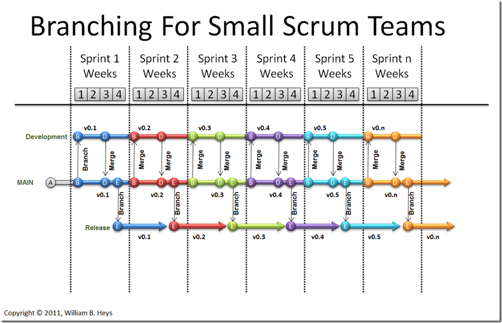
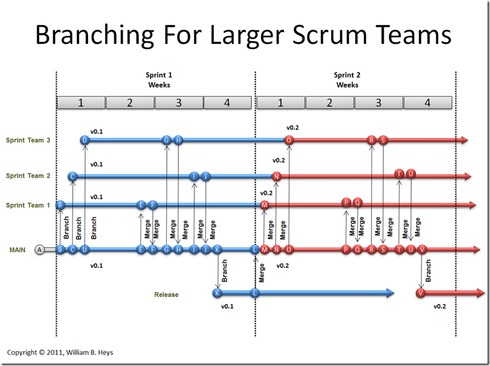

# Branching - Team Foundation Server (TFS)

## Known Branching Strategies

* Feature branching
* Release branching
* Small Team branching
* Large Team branching

### Feature Branching

### Release Branching

### Small Team Branching

### Large Team Branching

---
Some of the actual names of the branching strategies may differ from actual known name. The given name is from minimal research.
