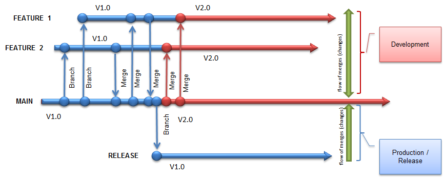

# Branching - Team Foundation Server (TFS)

## Known Branching Strategies

* Feature branching
* Release branching
* Small Team branching
* Large Team branching

### Feature Branching

#### Description
Feature branching is the approach of creating a new branch off of **main** for every **feature** that is to be implemented during the sprint. Once the **feature** has been completed, the branch merges **main** into itself, and once all conflicts have been resolved (if any) the branch is merged into **main**. At this point once the branch is no longer needed it is deleted, and all features are merged into **release**.

#### Key Points
* Number of branches are equal to number of features, plus **main** branch (unstable), and **release** branch (stable).
* **Main** is always alive.
  * Developers code directly on this branch.
* **Release** is always alive.
  * QA tests directly on this branch.
  * This branch goes directly to production.

### Release Branching

#### Description
Release branching is the approach of creating a new branch off of **main** at the end of each sprint. The **release** branch is alive until the next branch is created. At that moment the previous **release** branch is merged into **main**, and the new **release** branch is then created.

#### Key Points
* 1 to 2 branches are always alive
* **Main** is always alive.
  * Developers code directly on this branch.
* **Release** is newly created for every release.
  * QA tests directly on this branch.
  * This branch goes directly to production.

### Small Team Branching

#### Description
Small team branching is the approach of having 3 branches alive at all times. The branches are **development**, **main**, and **release**. Under this model all developers code all features in the **development** branch, once their features are completed they are merged into **main** for testing. Once the sprint is completed all changes made into **main** are then merged into **release**, making that branch the most stable code branch.

#### Key Points
* 3 branches are always alive
* **Development** is always alive.
  * Developers code directly on this branch.
* **Main** is always alive.
  * QA tests directly on this branch.
* **Release** is newly created for every release.
  * This branch goes directly to production.

### Large Team Branching

#### Description
Large team branching is similar to the approach of *small team branching*, except here every sprint team has their own **development** branch. This allows for each team to be able to code independently without having to worry about code colliding during feature development.

#### Key Points
* 3 or more branches are always alive
* **Development** (each team) is always alive.
  * Developers code directly on this branch.
* **Main** is always alive.
  * QA tests directly on this branch.
* **Release** is newly created for every release.
  * This branch goes directly to production.

---
Some of the actual names of the branching strategies may differ from actual known name. The given name is from minimal research.
